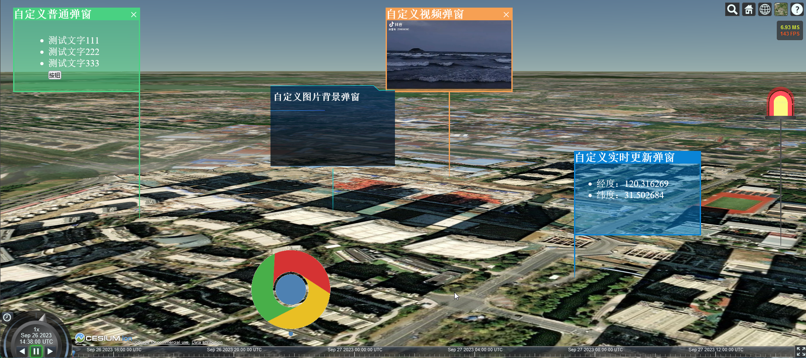

# cesium_custom_popup

## 一.关于项目

### 1.背景

cesium.js 是一款优秀三维地理可视化框架，由于 cesium.js 框架自身没有内置弹窗组件，但在业务开发中，经常遇到各种定制化开发的弹窗提示组件的需求。在此背景下，cesium_custom_popup 库封装开发了一个可实例化的自定义弹窗类。只需一两行代码，就可以 DIY 得到你想要的弹窗。

### 2.版本

```
1.1.2
```

### 3.作者

```
name:	康伟涛
e-mail: kangweitao1998@163.com

客官觉得满意，就施舍个小星星吧。谢谢！
GitHub：https://github.com/giserKangweitao/cesium_custom_popup
Gitee: https://gitee.com/giser_kangweitao/cesium_custom_popup
```

## 二.功能特性

- 特性 1：减少开发量，只需实例化弹窗类就可以得到一个自定义弹窗。
- 特性 2：自由定制化，通过 html 字符串即可构建：普通弹窗，媒体弹窗，交互弹窗，实时更新弹窗。
- 特性 3：样式可编辑，通过 option 配置项，来 DIY 你想要的弹窗的样式。
- 特性 4：实时性更新，通过实例方法 updateOption(),updateHtml()来实时更新弹窗位置和内容。
- 特性 5： 自定义交互，通过示例方法 onClickPopup(),onMouseOverPopup(),onMouseOutPopup()定义交互事件。

## 三.快速开始

### 1.安装

```shell
npm install cesium_custom_popup
```

### 2.引入

```js
import CustomPopup from "cesium_custom_popup";
```

### 3.使用

```js
const popup = new CustomPopup(position, html, type, [option]);
```

## 四.参数

- position

> 作用：弹窗显示位置
>
> 类型：数组
>
> 必需参数：是
>
> ```js
> const position = [lng, lat, elevation];
> ```

- html

> 作用：弹窗嵌入的内容
>
> 类型：字符串
>
> 必需参数：是
>
> ```js
> const html = `
>         <ul style="width: 100%; height: 100%;font-size:22px; color:white;padding top:60px;padding-left:80px">
>         <li>测试文字111</li>
>         <li>测试文字222</li>
>         <li>测试文字333</li>
>         </ul>`;
> ```

- type

> 作用：弹窗类型
>
> 类型：字符串
>
> 必需参数：是
>
> 可选值：
>
> | 参数          | 含义         |
> | ------------- | ------------ |
> | "common"      | 普通弹窗     |
> | "medium"      | 媒体弹窗     |
> | "interaction" | 交互弹窗     |
> | "update"      | 实时更新弹窗 |
>
> ```js
> const type = `common`;
> const type = `medium`;
> const type = `interaction`;
> const type = `update`;
> ```

- option

> 作用：弹窗配置项
>
> 类型：对象
>
> 必需参数：否
>
> ```js
> const option = {
> title, // 弹窗标题，字符串，非必须参数
> showTitle, // 是否显示标题，布尔值，非必须参数
> showClose, // 是否显示关闭按钮，布尔值，非必须参数
> lineHeight, // 连接线高度，整数，非必须参数
> lineWidth, // 连接线宽度，整数，非必须参数
> lineColor, // 连接线颜色，十六进制颜色值，非必须参数
> popupAt, // 弹窗弹出位置，字符串，非必须参数，('left' 或 'center' 或 'right')
> borderColor, // 弹窗边框颜色，十六进制颜色值，非必须参数
> backgroundColor, // 弹窗背景颜色，十六进制颜色值，非必须参数
> scale, // 弹窗缩放比例，整数或浮点数，非必须参数
> xyRatio， //弹框宽高比，数组，非必须参数
> };
> ```

## 五.方法

- addTo()

  > 作用：添加弹窗
  >
  > 参数：viewer
  >
  > ```js
  > popup.addTo(viewer);
  > ```

- removeFrom()

  > 作用：移除弹窗
  >
  > 参数：viewer
  >
  > ```js
  > popup.removeFrom(viewer);
  > ```

- updatePosition()

  > 作用：更新弹窗位置
  >
  > 参数：position
  >
  > ```js
  > popup.updatePosition(position);
  > ```

- updateHtml()

  > 作用：更新弹窗内容
  >
  > 参数：html
  >
  > ```js
  > popup.updateHtml(html);
  > ```

- onClosePopup()

  > 作用：关闭弹窗时触发的事件
  >
  > 参数：callback
  >
  > ```js
  > popup.onClosePopup(callback);
  > ```

- onClickPopup()

  > 作用：鼠标点击弹窗时触发的事件
  >
  > 参数：callback
  >
  > ```js
  > popup.onClickPopup(callback);
  > ```

- onMouseOverPopup()

  > 作用：鼠标移入弹窗时触发的事件
  >
  > 参数：callback
  >
  > ```js
  > popup.onMouseOverPopup(callback);
  > ```

- onMouseOutPopup()

  > 作用：鼠标移出弹窗时触发的事件
  >
  > 参数：callback
  >
  > ```js
  > popup.onMouseOutPopup(callback);
  > ```

## 六.示例

### 1.代码

```html
<!--
 * @Description: cesium自定义弹窗Demo
 * @Version: 1.0
 * @Autor: Kangweitao
 * @Date: 2023-09-22 17:20:43
 * @LastEditors: Please set LastEditors
 * @LastEditTime: 2023-09-26 22:34:31
-->
<!DOCTYPE html>
<html lang="en">
  <head>
    <meta charset="UTF-8" />
    <title>cesium自定义弹窗Demo</title>
    <style>
      * {
        padding: 0;
        margin: 0;
      }

      #cesium-container {
        width: 100vw;
        height: 100vh;
        overflow: hidden;
      }
    </style>

    <link
      rel="stylesheet"
      href="//lf6-cdn-tos.bytecdntp.com/cdn/expire-1-y/cesium/1.86.1/Widgets/widgets.min.css"
    />
    <script src="//lf6-cdn-tos.bytecdntp.com/cdn/expire-1-M/cesium/1.90.0/Cesium.js"></script>
    <!-- 使用unpkg -->
    <script src="https://unpkg.com/@turf/turf/turf.min.js"></script>
  </head>

  <body>
    <div id="cesium-container"></div>
  </body>
  <script type="module">
    import CustomPopup from "./cesium_custom_popup/dist/index.min.js";

    Cesium.Ion.defaultAccessToken = "自己token";
    const viewer = new Cesium.Viewer("cesium-container");
    viewer.scene.debugShowFramesPerSecond = true; // 显示帧率

    const listHtml = `
        <ul style="width: 100%; height: 100%;font-size:22px; color:white;padding-top:60px;padding-left:80px">
        <li>测试文字111</li>
        <li>测试文字222</li>
        <li>测试文字333</li>
        <button id="btn">按钮</button>
        </ul>
    `;
    const p1 = new CustomPopup(
      [120.311889, 31.501064, 0],
      listHtml,
      "interaction",
      { lineHeight: 300 }
    );
    p1.addTo(viewer);
    p1.onClosePopup(() => {
      console.log("关闭了p1");
    });
    p1.onClickPopup((e) => {
      if (e.target.id === "btn") {
        alert("点击了p1-按钮");
      }
    });

    const videoHtml = ` 
        <video class="video" style="margin-top:10px;width: 100%; height: 100%;" controls autoplay loop>
            <source src="./video/test.mp4" type="video/mp4">
        </video>
   `;
    const p2 = new CustomPopup(
      [120.311889, 31.505064, 0],
      videoHtml,
      "medium",
      {
        title: "自定义视频弹窗",
        popupAt: "center",
        borderColor: "#f6a053",
        backgroundColor: "#f6a05380",
        lineColor: "#f6a053",
        showClose: true,
      }
    );
    p2.addTo(viewer);

    const imageHtml = ` 
        <div class="image" style="width: 100%; height: 100%;background-image: url('./img/popup_bg.png');background-position: center center;background-size: cover;">
            <div class="title" style="width: 100%; height: 20%;padding-top:5%;padding-left:2%;font-weight: bolder; color:white;font-size:140%;line-hignt:20%;">自定义图片背景弹窗</div>
        </div>
   `;
    const p3 = new CustomPopup([120.315889, 31.503064, 0], listHtml, "update", {
      title: "自定义实时更新弹窗",
      popupAt: "left",
      borderColor: "#0a84d6",
      backgroundColor: "#0a84d680",
      lineColor: "#0a84d6",
      showClose: false,
      showTitle: true,
      lineHeight: 100,
    });
    p3.addTo(viewer);
    let lng = 120.315889;
    let lat = 31.503064;
    setInterval(() => {
      const html = `
        <ul style="width: 100%; height: 100%;font-size:22px; color:white;padding-top:60px;padding-left:50px">
        <li>经度：${lng.toFixed(6)}</li>
        <li>纬度：${lat.toFixed(6)}</li>
        </ul>
    `;
      p3.updateHtml(html);
      p3.updatePostion([lng, lat, 0]);
      lng += 0.00001;
      lat -= 0.00001;
    }, 500);

    const p4 = new CustomPopup(
      [120.312889, 31.502664, 0],
      imageHtml,
      "common",
      {
        popupAt: "center",
        borderColor: "#0a84d600",
        backgroundColor: "#0a84d600",
        lineColor: "#0bd8e180",
        showClose: false,
        showTitle: false,
        lineHeight: 100,
      }
    );
    p4.addTo(viewer);

    const chromHtml = `
    `;
    const p5 = new CustomPopup(
      [120.315889, 31.500664, 0],
      chromHtml,
      "common",
      {
        lineWidth: 10,
        lineHeight: 10,
        scale: 1.0,
        popupAt: "center",
        borderColor: "#0a84d600",
        backgroundColor: "#0a84d600",
        lineColor: "#4e81b2",
        showClose: false,
        showTitle: false,
        xyRatio: [2, 2],
      }
    );
    p5.addTo(viewer);

    const warningHtml = `
    `;
    const p6 = new CustomPopup(
      [120.316889, 31.504664, 0],
      warningHtml,
      "interaction",
      {
        lineHeight: 300,
        scale: 1.0,
        popupAt: "center",
        borderColor: "#0a84d600",
        backgroundColor: "#0a84d600",
        lineColor: "#484848",
        showClose: false,
        showTitle: false,
        xyRatio: [1, 1],
      }
    );
    p6.addTo(viewer);
    p6.onClickPopup(() => {
      alert("点击了p1-报警");
    });
    p6.onMouseOverPopup(() => {
      alert("移入p1-报警");
    });
    p6.onMouseOutPopup(() => {
      alert("移出p1-报警");
    });

    viewer.camera.flyTo({
      destination: Cesium.Cartesian3.fromDegrees(
        ...[120.312889, 31.505664],
        2000
      ),
    });
  </script>
</html>
```

### 2.效果


